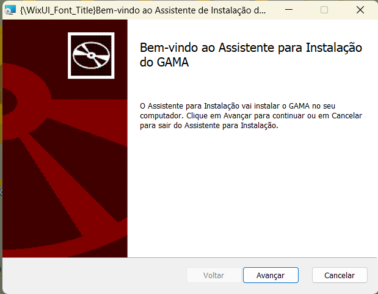
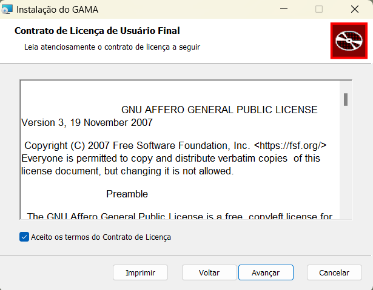
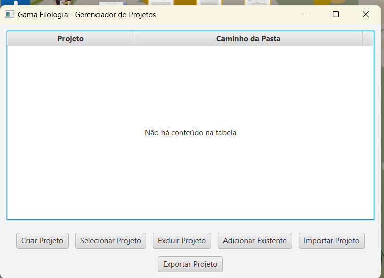
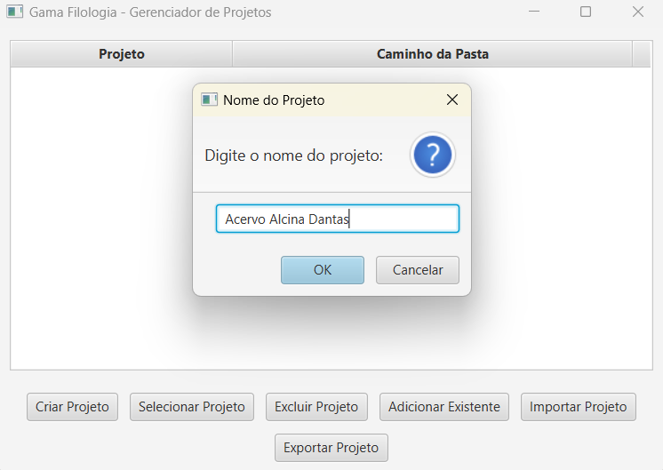
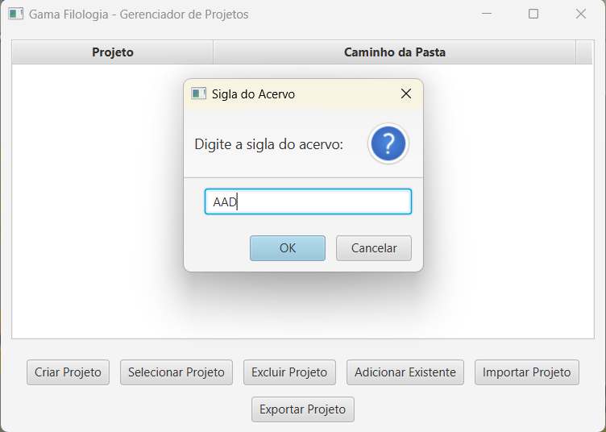
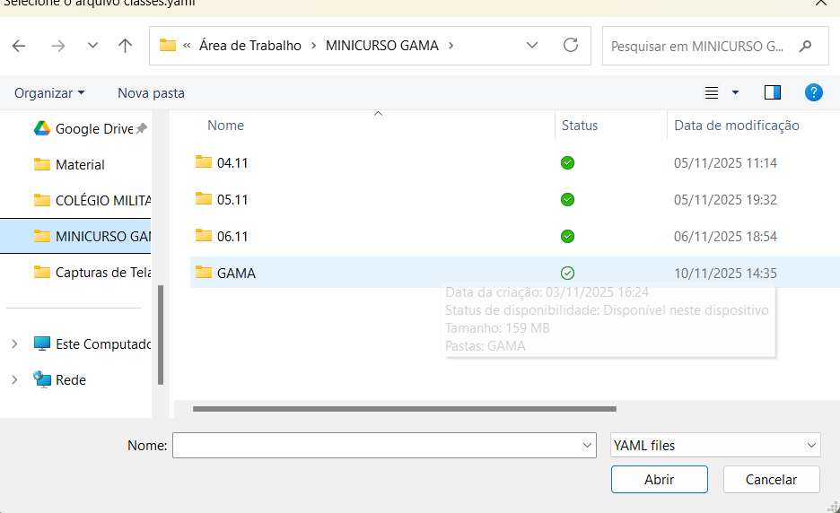
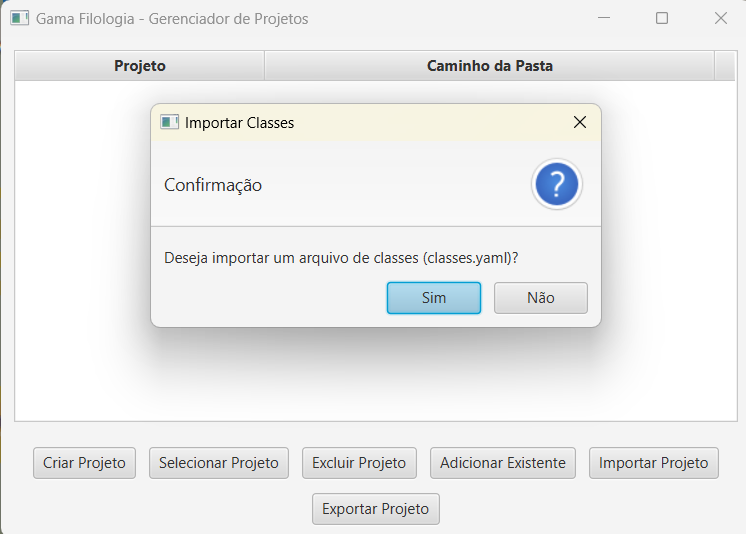

# Guia de Instalação — GAMA Filologia
## 1. Requisitos
- Windows 10 ou superior (64-bit)
- Java 17 ou superior (incluído no pacote de instalação)
---
## 2. Instalação
### 2.1 Executar o Instalador
Execute o ficheiro `.msi` e siga os passos do assistente:

### 2.2 Aceitar a Licença de Uso
Leia e aceite os termos de licença para continuar:

---
## 3. Primeiro Acesso
Ao abrir o GAMA pela primeira vez, você verá a tela de início:

---
## 4. Criar um Projeto
### 4.1 Nome do Projeto
1. Clique em **Criar Projeto**.
2. Informe o nome do projeto:

### 4.2 Sigla do Acervo
Informe a sigla do acervo:

3. Clique em **OK** para confirmar.
---
## 5. Configuração Inicial de Séries
Antes de adicionar documentos, configure as séries (classes de produção):

Após importar o arquivo de séries:

---
## 6. Próximos Passos
Com o projeto criado e as séries configuradas, consulte o **Manual do Utilizador** disponível no menu **Ajuda** da aplicação para aprender a gerir documentos, realizar transcrições e exportar relatórios.